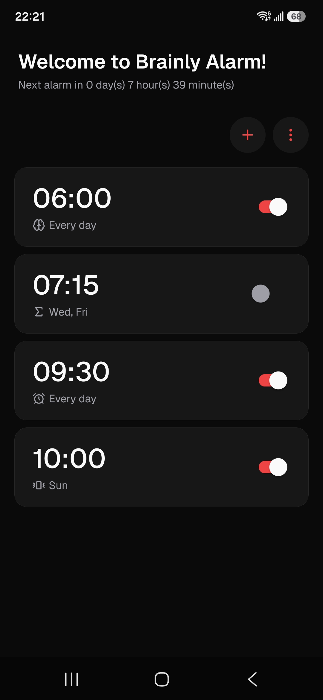
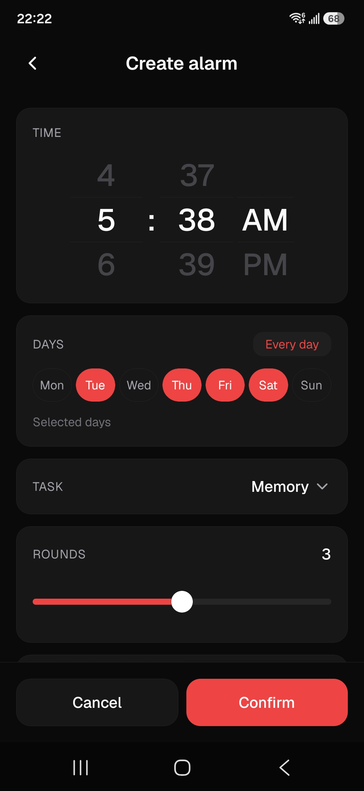
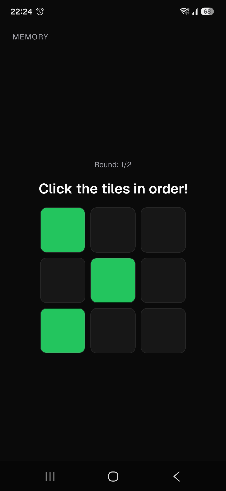
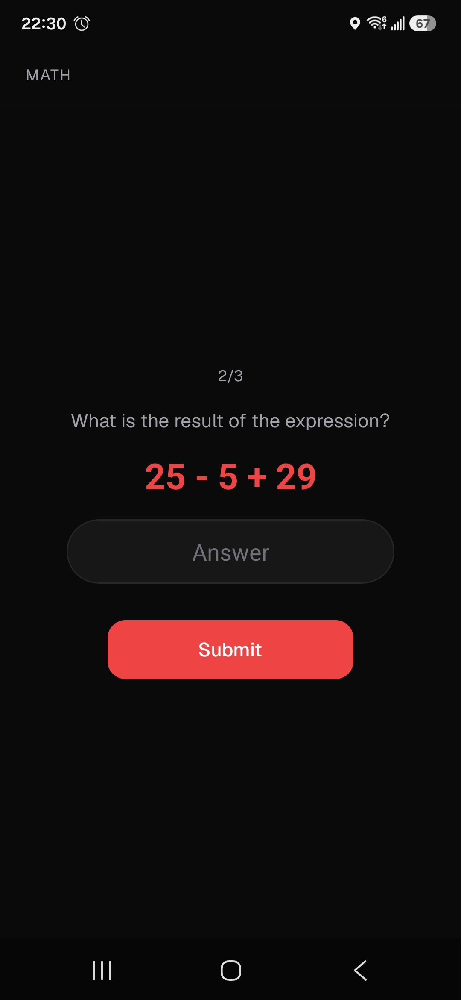
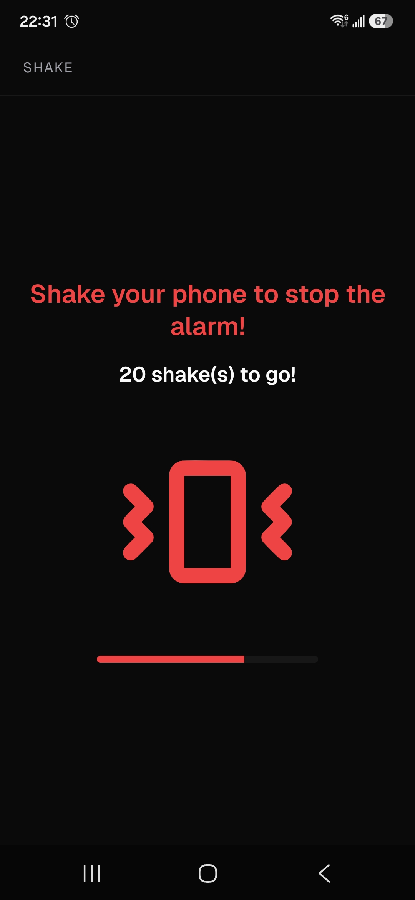

# Brainly Alarm

A task-based alarm clock app built with **React Native** and **Expo**. To turn off an alarm, you must complete a cognitive or physical task — a memory game, math equations, or shaking your phone — before the sound stops.

> **Note:** This project is a **re-implementation of the original Brainly Alarm native Android app** (Kotlin/Jetpack Compose). The original repository is available at <https://github.com/HoweiAY/brainly-alarm>.

## About

Many people struggle to wake up due to **sleep inertia** — the grogginess and drowsiness experienced immediately after waking, which leads to disorientation, reduced performance, and oversleeping. Conventional alarm clocks do little to help: one tap and you're back to sleep.

Brainly Alarm's philosophy is that waking up should require just enough **mental (or physical) engagement** to bridge the gap between sleep and full alertness. By forcing you to complete a short task before the alarm silences, the app stimulates your brain, combats sleep inertia, and helps you start the day productive.

This repository is the **Expo-first re-implementation** of that original app. The authoritative product specifications for this port are in [`docs/`](docs/README.md); the original Kotlin source is reference-only.

## Features

- **Task-based alarm dismissal** — the alarm keeps sounding until you finish the configured task:
  - **Memory game** — watch a sequence of tiles light up on a grid, then repeat it in order (3×3 grid on Easy/Normal, 4×4 on Hard).
  - **Math equation** — solve randomly generated arithmetic equations; difficulty controls operand count, ranges, and operators.
  - **Shake phone** — physically shake the device a target number of times, detected via the accelerometer.
  - **None** — a plain alarm with no task.
- **Full alarm management** — create, edit, delete, and toggle multiple alarms from the home screen.
- **Flexible scheduling** — pick a time with the wheel picker and choose specific weekdays; leaving all days unselected rings every day.
- **Customizable tasks** — configure the number of rounds (1–5) and difficulty (Easy / Normal / Hard) per alarm.
- **Alarm sound support** — alarms play the device's default alarm tone; the data model and native player support custom audio URIs.
- **Snooze** — optional snooze that re-triggers the alarm 5 minutes later.
- **Exact, wake-up alarms** — precise scheduling that wakes the device, with automatic re-arming after device reboot (Android, via a custom native module).
- **Alarm notifications & deep links** — a high-priority notification fires with the alarm; tapping it opens the full-screen ringing screen directly.
- **Local persistence** — all alarms are stored on-device in SQLite with versioned migrations.
- **User settings** — a dedicated Settings screen lets you tune app-wide preferences: auto-dismiss tasks after they time out, the snooze duration (in minutes), and whether the Memory task tiles display numbers. Settings are persisted on-device via a dedicated Zustand store.

## Screenshots

### Menus

<div align="center">
  
  
</div>

### Alarm dismissal tasks

<div align="center">
  
  
  
</div>

## Tech Stack

| Layer            | Technology                                                                                                                                                     |
| ---------------- | -------------------------------------------------------------------------------------------------------------------------------------------------------------- |
| Language         | TypeScript                                                                                                                                                     |
| Framework        | [Expo](https://expo.dev) SDK ~57 (managed workflow + dev client), React Native 0.86, React 19                                                                  |
| Navigation       | [Expo Router](https://docs.expo.dev/router/introduction/) (file-based routing, route groups, full-screen modal alarm flow)                                     |
| State management | [Zustand](https://github.com/pmndrs/zustand) (+ Immer) — shared `alarmStore`, firing/registration stores                                                       |
| Persistence      | [expo-sqlite](https://docs.expo.dev/versions/latest/sdk/sqlite/) + [Drizzle ORM](https://orm.drizzle.team) (`drizzle-orm/expo-sqlite`), drizzle-kit migrations |
| Alarm scheduling | Custom Expo native module (`alarm-scheduler`) — Kotlin on Android (`AlarmManager`, wake-up broadcasts, boot receiver), Swift on iOS                            |
| Notifications    | `expo-notifications` + deep links (`brainlyalarmexpo://alarm`)                                                                                                 |
| Sensors          | `expo-sensors` (Accelerometer) for the shake task                                                                                                              |
| Math evaluation  | [`expr-eval`](https://github.com/silentmatt/expr-eval) (safe expression parsing — no `eval`)                                                                   |
| UI               | `@expo/ui`, Lucide icons (`@react-native-vector-icons/lucide`), Geist font family                                                                              |
| Testing          | Jest (unit tests for pure scheduling/task logic)                                                                                                               |
| Tooling          | ESLint (`eslint-config-expo`), Prettier, Husky + lint-staged, TypeScript                                                                                       |

> **Note on iOS:** iOS does not allow third-party apps to schedule exact wake-up alarms, so alarm behavior is degraded there compared to Android. This is a platform limitation, not a bug.

## Get Started

### Prerequisites

- [Node.js](https://nodejs.org/) (LTS) and npm
- **Android:** Android Studio with the Android SDK and a JDK (for building the custom native module)
- **iOS:** macOS with Xcode and CocoaPods
- A physical device or emulator/simulator

> **Expo Go is not supported.** The app relies on a custom native module (`alarm-scheduler`), so you must use a [development build](https://docs.expo.dev/develop/development-builds/introduction/) via `expo run:android` / `expo run:ios`.

### Install

```bash
npm install
```

This also sets up Husky git hooks automatically (via the `prepare` script).

### Run the app

```bash
# Start the Metro dev server
npm start

# Build the native project and run on Android (device or emulator)
npm run android

# Build the native project and run on iOS (simulator or device, macOS only)
npm run ios
```

The first `expo run:*` invocation runs `expo prebuild` to generate the `android/` / `ios/` native projects, then compiles a dev client. Afterwards, use `npm start` and reload in the dev client for everyday development.

```bash
# Web preview (UI only — native alarm scheduling is unavailable)
npm run web
```

### Build the native module

The custom `alarm-scheduler` module lives in [`native/`](native/). Rebuild it after changing anything under `native/android/` (Kotlin sources, `build.gradle`, `AndroidManifest.xml`) or `native/ios/` (Swift sources, podspec):

```bash
# Build for both platforms (default), or pass android | ios | all
npm run build:native
npm run build:native android
npm run build:native ios
```

The script runs `expo prebuild` if the native project directories are missing, then compiles just the module: `./gradlew :expo.modules.alarmscheduler:assembleRelease` on Android, `pod install` on iOS. The module is auto-linked via `expo.autolinking.nativeModulesDir` in `package.json`, and its config plugin (`native/app.plugin.js`) is registered in `app.json`.

### Database migrations

The schema is defined in [`src/data/schema.ts`](src/data/schema.ts) and managed with drizzle-kit. After editing the schema:

```bash
# Generate a new SQL migration into drizzle/
npm run db:generate
```

Migrations are applied automatically at app startup by `src/data/db.ts`. Include the generated `drizzle/` artifacts when committing schema changes.

### Test, lint, and typecheck

```bash
# Run the Jest unit tests (test/)
npm test

# Lint with ESLint
npm run lint

# Typecheck
npx tsc --noEmit

# Format with Prettier
npm run format
```

### All scripts

| Script                            | Description                                                              |
| --------------------------------- | ------------------------------------------------------------------------ |
| `npm start`                       | Start the Expo dev server (Metro)                                        |
| `npm run android`                 | Prebuild (if needed), build, and run the app on Android                  |
| `npm run ios`                     | Prebuild (if needed), build, and run the app on iOS                      |
| `npm run web`                     | Start a web preview (no native alarm scheduling)                         |
| `npm test`                        | Run Jest unit tests                                                      |
| `npm run lint`                    | Run ESLint                                                               |
| `npm run format`                  | Format the codebase with Prettier                                        |
| `npm run db:generate`             | Generate Drizzle SQL migrations from `src/data/schema.ts`                |
| `npm run build:native [platform]` | Compile the `alarm-scheduler` native module (`android`, `ios`, or `all`) |

## Project Structure

```
brainly_alarm_expo/
├── app.json                  # Expo config (plugins, scheme, icons)
├── package.json              # Dependencies and npm scripts
├── drizzle.config.ts         # drizzle-kit config (SQLite / expo driver)
├── babel.config.js           # babel-plugin-inline-import (.sql migrations)
├── metro.config.js           # Metro config (adds .sql to sourceExts)
├── jest.config.js            # Jest config
│
├── src/
│   ├── app/                  # Expo Router routes (file-based)
│   │   ├── _layout.tsx       #   Root stack, store init, deep-link handling
│   │   ├── (main)/           #   Main group: home (alarm list), create/edit alarm,
│   │   │                     #     and settings
│   │   └── (alarm)/          #   Alarm group (full-screen modal): ringing screen
│   │       └── tasks/        #     Memory game, math equation, shake screens
│   ├── alarms/               # Alarm scheduling domain logic (native module facade,
│   │                         #   weekly triggers, snooze, conflicts, sound)
│   ├── components/           # Reusable UI (AlarmCard, CreateAlarmForm,
│   │                         #   TimeWheelPicker, WeekdayTextButton, settings rows, ...)
│   ├── data/                 # Persistence: Drizzle schema, db + migrations runner,
│   │                         #   conversions, constants, types
│   ├── hooks/                # Shared hooks (useAlarmDismissal, useAlarmNotifications, ...)
│   ├── notifications/        # Alarm notification channel & content
│   ├── settings/             # User-settings helpers (snooze parsing/clamping,
│   │                         #   normalization to UserSettings defaults)
│   ├── store/                # Zustand stores (alarmStore, alarmFiringStore,
│   │                         #   alarmRegistrationsStore, settingsStore)
│   ├── tasks/                # Pure, testable dismissal-task logic + React hooks
│   ├── theme/                # Colors, spacing, radii, typography
│   └── utils/                # Time helpers
│
├── native/                   # Custom "alarm-scheduler" Expo native module
│   ├── android/              #   Kotlin: AlarmSchedulerModule, AlarmReceiver,
│   │                         #   AlarmSoundService, BootReceiver
│   ├── ios/                  #   Swift: AlarmSchedulerModule
│   └── app.plugin.js         #   Expo config plugin
│
├── drizzle/                  # Generated SQL migrations + metadata
├── test/                     # Jest unit tests
├── scripts/                  # Build tooling (build-native-module.js)
├── assets/                   # Fonts (Geist), icons, splash images
├── android/                  # Prebuilt native Android project (generated)
└── docs/                     # Product & architecture specifications (source of truth)
    └── images/               #   Media assets (screenshots, diagrams)
        └── screenshots/      #   App screenshots featured in the README
```

## Documentation

The [`docs/`](docs/README.md) folder contains the authoritative specifications for this app — the data layer, scheduling system, navigation/UI architecture, dismissal-task state machines, sound/notifications, and the React Native migration guide. The [`docs/images/`](docs/images/) folder holds the media assets referenced by the specs and the README (notably the app screenshots in `docs/images/screenshots/`). Read the relevant doc before modifying a subsystem.

## License

See [LICENSE](LICENSE).
